# Architecture

`app/main.py` is the single FastAPI composition root. API handlers call services; services own SQL repositories,
prepared peer selection, optional vision, and workflow invocation. Agents receive Pydantic contracts rather than a
database session.

```mermaid
flowchart LR
    U["Unlisted product + optional image"] --> API["FastAPI /api/v1: 202 async run"]
    API --> V["Conditional Qwen vision"]
    API --> P["Prepared catalog + FTS candidate filter"]
    P --> E["Embedding rerank of 40 candidates"]
    E --> G["Up to 30 peers that pass configured thresholds"]
    G --> Q["Offset lookup of peer reviews"]
    G --> DB["Independent runtime SQLite"]
    Q --> DB
    G --> C1["Chroma product_knowledge + MMR"]
    Q --> C2["Chroma review_insight + MMR"]
    DB --> S["Peer-group SQL StatisticsProvider"]
    C1 --> PM["ProductMarketAgent / DeepSeek LCEL"]
    C2 --> UI["UserInsightAgent / DeepSeek LCEL"]
    S --> PM
    S --> UI
    PM --> OD["OperationsDecisionAgent / Qwen LCEL"]
    UI --> OD
    OD --> EA["EvidenceAuditAgent / Qwen LCEL"]
    EA -->|"deterministic reject: at most one retry"| OD
    EA --> R["Persist state, evidence, timings, Markdown + JSON"]
    R --> SSE["Persisted timeline + replayable SSE"]
    R --> RS["Immutable report versions + guarded support"]
```

ProductMarketAgent and UserInsightAgent are separate LangGraph fan-out nodes and execute concurrently. Fan-in occurs
only before OperationsDecisionAgent. Node timestamps are persisted and `parallel_agent_overlap` is computed from their
actual intervals.

Each Real Agent runs one typed LCEL chain:
`prompt | ChatModel | evidence-aware normalization | PydanticOutputParser`. Only JSON decoding or Pydantic Schema
failures can repeat that chain, bounded by `MODEL_PARSE_MAX_RETRIES`. Provider/network retries use the independent
`MODEL_MAX_RETRIES` setting. Persisted Agent output records model-call count, parse-retry count, parser name and token
usage when the provider returns it.

The dispatcher runs analysis outside the request thread. SQLite uses WAL and a bounded busy timeout so frontend status
reads can coexist with peer/evidence writes. Each real background run initializes its Chroma client in the worker
thread; duplicate source reviews are removed after offset lookup and duplicate document IDs are collapsed before a
Chroma upsert. Stage and event rows are committed before SSE delivery, so reconnecting clients replay durable state.

Optional product-background context is behind `BackgroundProviderRegistry`. The default registry returns no external
facts. A configured provider must return dated, jurisdiction-scoped evidence; Agents and audit receive only those
traceable records, never model-invented policy, tax, or platform facts.

Peer-group filtering applies `selected_parent_asins` only to peer-product evidence. Product-background evidence has a
separate scope and remains in the unified evidence set for OperationsDecisionAgent, EvidenceAuditAgent, persistence,
numbered report citations and the evidence-detail API.

## Offline and online boundary

Offline preparation may sequentially scan each source JSONL once and writes only ignored lightweight caches. Online
analysis may query catalog FTS, embed the bounded candidate set, seek selected review offsets, and upsert only the
selected peer group into the two small runtime Chroma collections. It may not rebuild caches, scan all source rows,
embed the full corpus, or touch the separate full-index workflow.

`product_type_flags.sqlite` is an optional full-catalog audit cache derived from the prepared catalog's source category
paths. It records one traceable flag for every `parent_asin`, including an explicit unresolved flag when categories are
missing. It supports inventory and data-quality review; it is not a global taxonomy, a fixed peer-group table, or a hard
online acceptance gate. A flag cannot create absent review evidence or guarantee that a terminal type has enough
qualified peers.
Its metadata includes the catalog source/schema signatures and the explicit source-leaf classifier version. A version
change invalidates only this optional audit cache; it does not rebuild catalog FTS, review offsets, or vector indexes.

FTS is a candidate-recall layer over normalized title, description, features, details, category text, and target
species. It is not a fixed-category lookup. No global category label or prebuilt peer group is required. Category
overlap is a weak rule-score contribution; direct product text, functions, structure, scenario, species, accessory
exclusion, and bounded semantic similarity determine acceptance. A same-main-category different terminal product
cannot qualify on category and price alone.

## Retrieval scopes

`KnowledgeStore.retrieve` supports `exact_product` for backward compatibility and `peer_group` for the real unlisted
product chain. Peer-group retrieval filters by the stable `peer_group_id`; retrieved peer evidence is additionally
restricted to the selected `parent_asin` set before Agents receive it.

The production peer-group Chroma adapter fetches a bounded candidate set and applies maximal marginal relevance using
the stored embeddings before evidence deduplication. Its `selection_strategy` and `mmr_lambda` metadata are carried
with each evidence item. The separate `RetrievalPipeline` retains conditional external reranking and records the
policy, model, candidate count, use and fallback state.

Small-Chroma ingestion and retrieval occur in the same worker run. A newly persisted HNSW segment can be briefly
unavailable on Windows; the adapter therefore retries only the read operation with a configured small backoff, then
raises the original Real-mode failure if the segment remains unavailable. It never rebuilds offline caches or changes
retrieval scope as recovery.

The group ID is a UUIDv5 over the normalized candidate signature (excluding temporary `product_id`), catalog source
signature, complete matching configuration including matcher version and thresholds, embedding model, and sorted
accepted ASIN set. It is therefore a candidate/data/config/result-specific analysis-group identifier, not
`product_type`, `categories`, `main_category`, an Amazon category ID, or a global classification label.

## Separate full-index retrieval path

The committed pre-index/full-index stack (`app.rag.query_builder`, filters, optional reranker, sufficiency checks, and
`RetrievalPipeline`) remains available for exact-product and evaluation workflows. Default Agents accept that pipeline
for backward compatibility, but the unlisted-product peer-group workflow supplies its already scoped evidence and does
not re-query or rebuild the full index.

## Configuration and observability

The composition root loads shared `.env` values followed by `.env.<APP_ENV>` overrides. Explicit `Settings` injection
continues to isolate tests. HTTP middleware emits only request ID, method, path, status, duration and exception type;
it never logs headers, query strings, bodies or credentials. Programmatic Alembic upgrades preserve the host
application's log handlers instead of replacing Uvicorn/test logging configuration.

Real Markdown is a presentation view, not the evidence store. It removes peer-group UUIDs, ASINs and inline machine
citations, uses readable product titles from the selected peer set and links `证据N` to the original persisted record.
The JSON report and evidence-detail endpoint retain all IDs, raw excerpts, source files and row locators.
