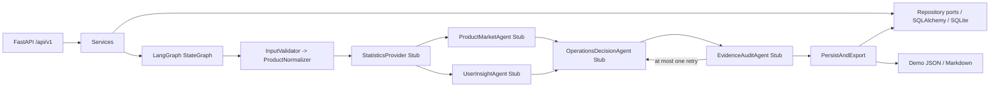

# Architecture

The only backend package is `app/`, and `app/main.py` is the only FastAPI entry point. Transport
calls services, services call repository ports and the workflow, and Agents never receive a database
session.

The two knowledge domains are `product_knowledge` and `review_insight`. Tests and smoke runs use an
in-memory store. `ChromaKnowledgeStore` is a minimal adapter that requires an injected embedding
function and never downloads a model itself.

The composition root injects a `KnowledgeStore` factory and a session-scoped `StatisticsProvider`
factory. Domain seed entry points resolve a configured `DomainAdapter` through
`config/domain_profiles/`; no Agent receives a database session.
